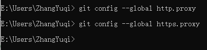
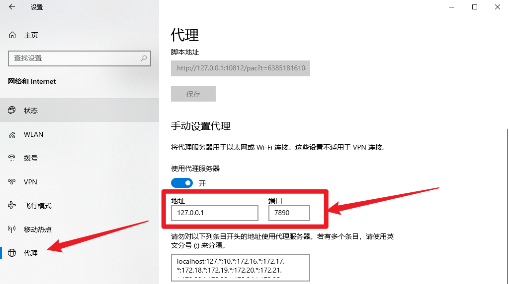

# Failed to connect to github.com port 443

---

- 参考资料：[GitHub push失败-Failed to connect to github.com port 443: Timed out](https://blog.csdn.net/weixin_43160744/article/details/119054656)

---

:::tip注意
本文为使用科学上网的情况下的解决方案，如未使用科学上网，请参考[ *此文* ](https://blog.csdn.net/weixin_43160744/article/details/119054656)解决。
:::

## 解决办法

### 1. 取消当前代理

-  按下 win + r ，输入 cmd 打开命令行窗口，输入以下命令：
  
   ```shell title="cmd"
    git config --global http.proxy
    git config --global https.proxy
   ```

- 如果什么也没有显示，说明目前没有设置代理，直接进行第二步 [*2. 重新设置代理(点我跳转)*](#2.重新设置代理)

    

- 显示一串数字说明有代理

    

  - 打开系统设置中的代理，看下地址和端口是否和 cmd 中查的一样

    

  -  如果一样还出现了这个错误，本文可能也没用，再找找别的方法吧
    
  -  如果不一样，在 cmd 中输入以下命令，取消之前的代理：
  
     ```shell title="cmd"
    git config --global --unset http.proxy
    git config --global --unset https.proxy
     ```

### 2. 重新设置代理 {#2.重新设置代理}

- 打开系统设置中的代理，看下地址和端口

    

- 在 cmd 中输入以下命令，127.0.0.1:7890 替换成自己的地址和端口号：

    

```shell title="cmd"
git config --global https.proxy 
git config --global http.proxy 
```