# 用 Docusaurus 和 Github 搭建静态网站

import {Highlight,PhotoZoom,MyColor,Light} from  '@site/src/components/ForMDX/forMDX';

---

### 我搭建时的环境

```
win10
Node.js v18.18.0
npm 9.8.1
yarn 1.22.19

2023年10月7日
```
---

<h3><Highlight bgColor={MyColor.green} fontColor={MyColor.white} >此行代码仅为方便我部署时复制</Highlight></h3>

```
cmd /C "set "GIT_USER=Ratherthan17" && yarn deploy"
```

---

:::tip 备注
本文有的图片不能点击放大，不是出问题了，而是因为我没给它们设置。
:::


---

<center>
<h1>
<Highlight bgColor={MyColor.docusaurusGreen} fontColor={MyColor.white}>正文</Highlight>
</h1>
</center>

## <B1>一、下载 Node.js</B1>

### · [*Node.js 官网*](https://nodejs.org/zh-cn/download)

import Nodejs from '../../static/img/GenerateSite/Preparation/DownloadNodejs.png';

<PhotoZoom src={Nodejs} alt="Node.js官网" />

:::caution注意
-  Node.js  得是 <Light>16.14 及以上的版本</Light>，安装好后，可以在命令行输入 ` node -v ` 敲回车查看安装的版本。
-  Node.js 只支持 Windows8.1 及以上，<Light>Windows7 不能用</Light>。原因是 Node.js 的版本太高了，v12.16.2 以上版本不支持 win7 系统，[可以下载 12.16.2 及以下的版本](https://nodejs.org/dist/v12.16.2/)[[1]](https://blog.csdn.net/weixin_37254196/article/details/109713817)。（好了，我在 win7 上试了试，下载了低版本的，创建站点时会出错）
:::

- 安装 <Highlight bgColor={MyColor.qing} fontColor={MyColor.docusaurusGreen} >yarn</Highlight> 包管理器

  - 补充：修改 <Light>npm</Light> 源——引用自 [Hexo 博客搭建基础教程(一)](https://www.fomal.cc/posts/e593433d.html) 
  > npm下载各种模块，默认是从国处服务器下载，速度较慢，<Light>建议配置成淘宝镜像</Light>。打开CMD窗口，运行如下命令:
  ```
    npm config set registry https://registry.npmmirror.com
  ```
  
```bash
npm install -global yarn
yarn config set registry https://registry.npmmirror.com # 使用淘宝维护的npm镜像源[2]
```

:::note备注
原先的淘宝npm镜像源 `https://registry.npm.taobao.org` 过期了，已更换为新的源 `https://registry.npmmirror.com` 

2024年7月26日晚
:::


---

## <B1>二、创建本地站点</B1>

### <B2>1.</B2> 打开命令行窗口 

- 找个地方新建一个文件夹，点进去（这些文件、文件夹的名字最好用英文名，不然可能会出问题）。  
点一下地址栏，输入 cmd，然后回车——在当前目录下打开命令行窗口  

import AddressBar from '../../static/img/GenerateSite/Preparation/AddressBar.png';
import Cmd from '../../static/img/GenerateSite/Preparation/Cmd.png';
import CMD2 from '../../static/img/GenerateSite/Preparation/CMD2.png';

<PhotoZoom src={AddressBar} alt="打开命令行窗口1" />
<PhotoZoom src={Cmd} alt="打开命令行窗口2" />
<PhotoZoom src={CMD2} alt="打开命令行窗口3" isCenter={true} />


### <Highlight bgColor={MyColor.docusaurusGreen} fontColor={MyColor.white} >2.</Highlight> 输入命令创建站点

```bash
npx create-docusaurus@latest my-website classic
```
:::tip提示
这个 "my-website" 可以自由命名，"classic" 是选用经典模板进行创建
:::

- 下面是创建成功的图片
  
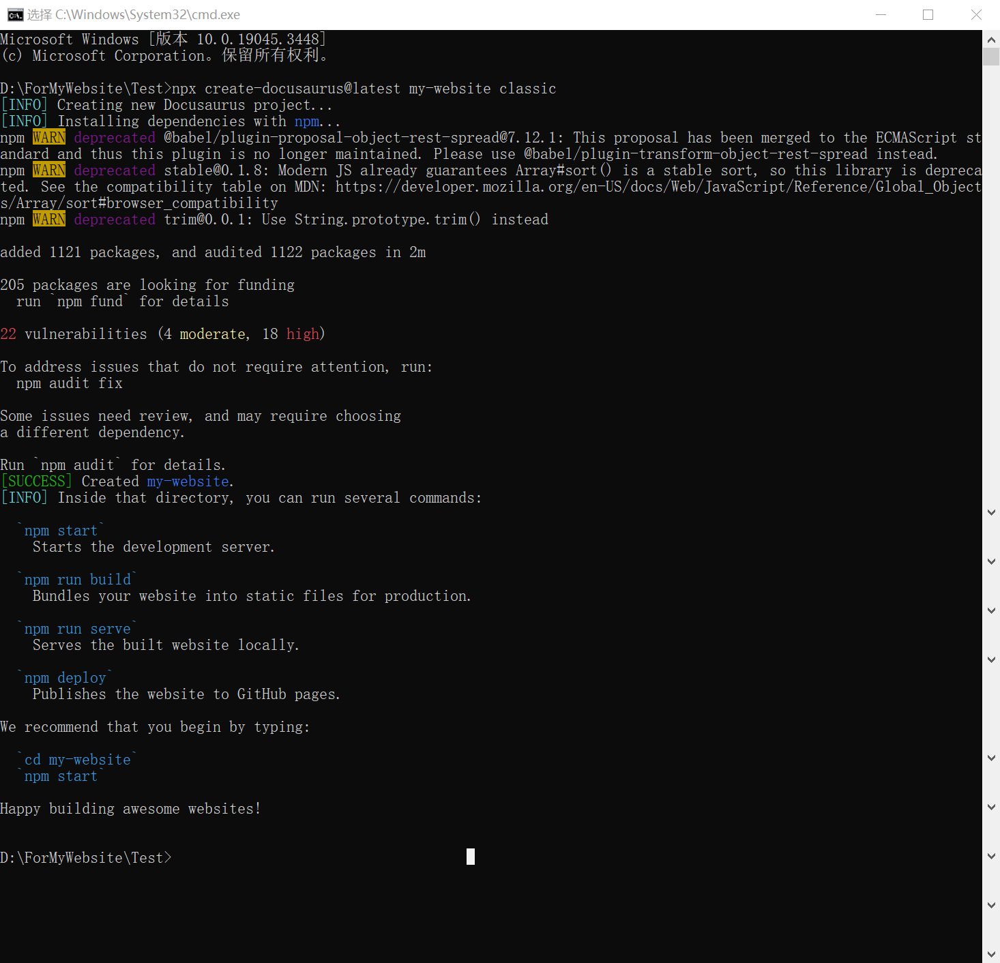

- 最下面有提示，输入

```shell
cd my-website
npm start
```

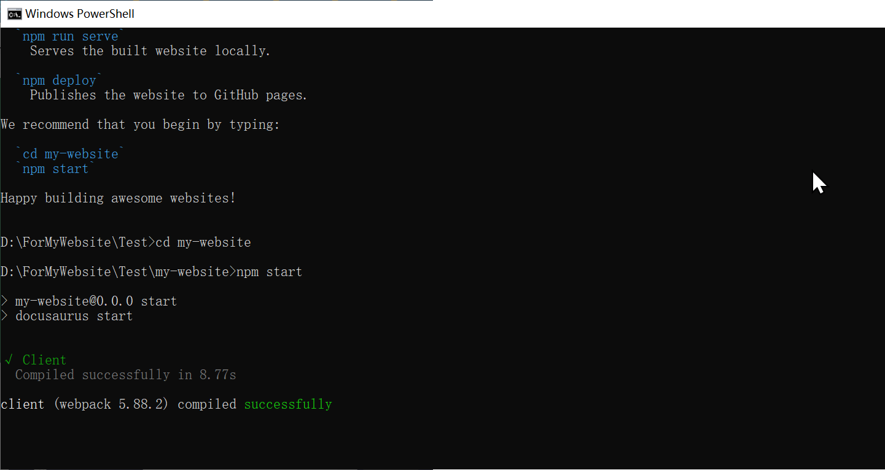

- 它会有一个绿色的条，等条走完了，会自动打开一个地址为 <Light>http://localhost:3000</Light> 的网站，这个网站和官方文档 [*5-minute tutorial*](https://tutorial.docusaurus.io/)  网站一模一样，因为创建时用的是经典模板


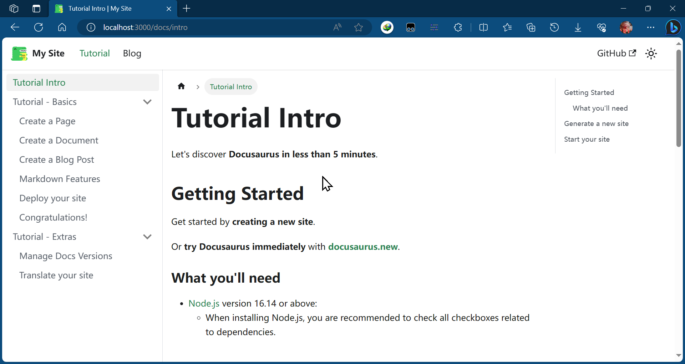
:::caution注意
要想在浏览器里看创建的网站 （http://localhost:3000 这个），**就必须得让之前输入 ` npm start ` 的控制台窗口运行着**，要是把它关了，网站就打不开了。
:::

- 下面是创建网站后，文件资源管理器中的文件  
  


---

## <B1>三、将本地站点发布到 GitHub Pages</B1>

### <B2>1.</B2> 在 <W>GitHub</W> 上新建 <W>github.io</W> 库

- 在 GitHub 上新建一个名为   **<W>你的账户名.github.io</W>**  的仓库

import NewGithubIo from '../../static/img/GenerateSite/Preparation/GithubIO/UserGithubIo.png';

<PhotoZoom src={NewGithubIo} alt="新建 github.io 库" />


- 进入仓库，点击 <W>settings</W> -> <W>pages</W> -> <W>Branch</W> 下边的选项选成 <W>main</W>，右边是<W>/(root)</W> -> <W>save</W>

import IOPages from '../../static/img/GenerateSite/Preparation/GithubIO/IOPages.png';

<PhotoZoom src={IOPages} alt="选择 main 分支" />

- 等一会，若上面出现："Your site is live at https://你的用户名.github.io/"，就说明网站创建好了。  
  可以点一下右边的 <W>`Visit site`</W> ， 或者在浏览器的地址栏里输入 <W>你的用户名.github.io</W> 回车，就可以看到创建的网站

import SiteCreated from '../../static/img/GenerateSite/Preparation/GithubIO/SiteCreated.png';

<PhotoZoom src={SiteCreated} alt="网站创建成功" />

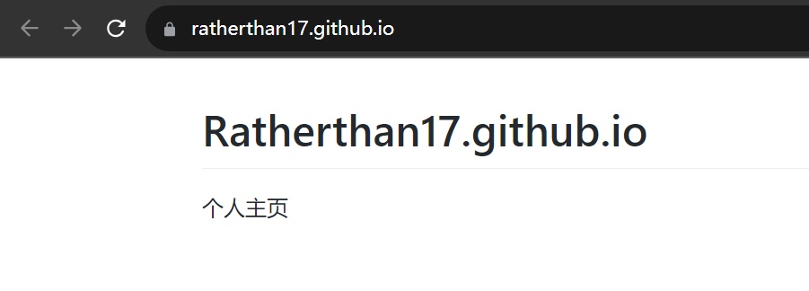

- 这里只有一个 Readme 文件的时候，打开网址会显示 Readme 里的内容，就是上面那张显示"个人主页"的图片

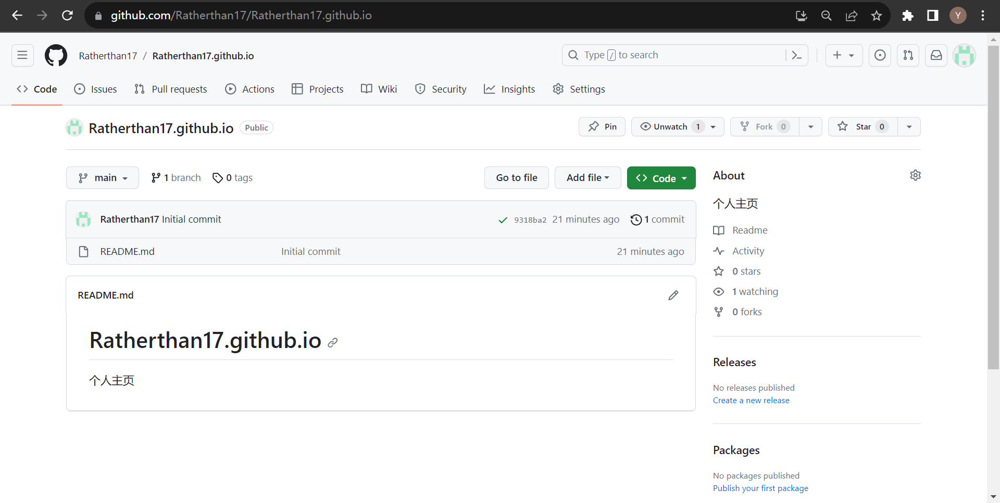

- 而若我创建了 <W>index.html</W> 文件，则会显示 index 里面的内容


- 还可以创建更多的 <W>.html</W> 文件，然后在 io 后面加上 <W>/文件名</W>，就可以访问到别的网页了

  
  

- 实际上如果你不嫌麻烦的话，已经可以通过写 html 文件来保存笔记了，想看的时候就在浏览器里输入 "你的用户名.github.io/" 加记笔记的那个文件名，而上面的 Nodejs 啊、创建 Docusaurus 本地站点也就不用弄了。  
 但是，我觉得用 Docusaurus 这样更方便的工具做的话不仅省事，而且用他们的模板做出来的还好看。  
  此外，我一个现在还不会前端的人，都能用它做出这个网站来，想必你若会的话，应该更轻松吧。

### <B2>2.</B2> 新建一个专门用来存放笔记的库

- 我新建了一个 MyNotes 库，用来演示
  

:::note备注
 这一步，你也可以不用跟着做，而是直接把构建出来的，你的 "my-website" 上传到  你的账户名.github.io  库里。  
  我只是觉得这样会比较乱？我也不知道，反正我想还是分门别类一下的好，记笔记的网站放在一个 notes 库里，将来要是又有了其他网站，A 网站的，就放到 A 库里；B 网站的，就放到 B 库里......这样是不是更清晰一些？  
  至于  账户名.github.io  就让它干干净净的当作一个个人主页吧！
:::

- [***官方文档***  ](https://docusaurus.io/zh-CN/docs/deployment#deploying-to-github-pages)里说要用到两个分支（ <W>Main</W> 和 <W>gh-pages</W> ），<W>Main</W> 用来存放源文件，<W>gh-pages</W> 用来存放部署后的文件

import Office1 from '../../static/img/GenerateSite/ForBuild/Office1.png';
import TwoBranches from '../../static/img/GenerateSite/ForBuild/TwoBranches.png';

<PhotoZoom src={Office1} alt="官方原文1" />
<PhotoZoom src={TwoBranches} alt="官方原文2" />

- 所以再新建一个 <W>gh-pages</W> 分支

import ghpages from '../../static/img/GenerateSite/ForBuild/gh-pages.png';

<PhotoZoom src={ghpages} alt="新建 gh-pages 分支" />

- 然后和配置  <W>你的用户名.github.io</W>  网页时的操作一样，不过 <W>Branch</W> 选择 <W>gh-pages</W>

import MyNotesSite0 from '../../static/img/GenerateSite/ForBuild/MyNotesSite0.png';

<PhotoZoom src={MyNotesSite0} alt="MyNotes 库" />


### <B2>3.</B2> 修改 docusaurus 相关配置文件

- 打开之前创建的 "my-website" 里的 <W>docusaurus.config.js</W> 文件

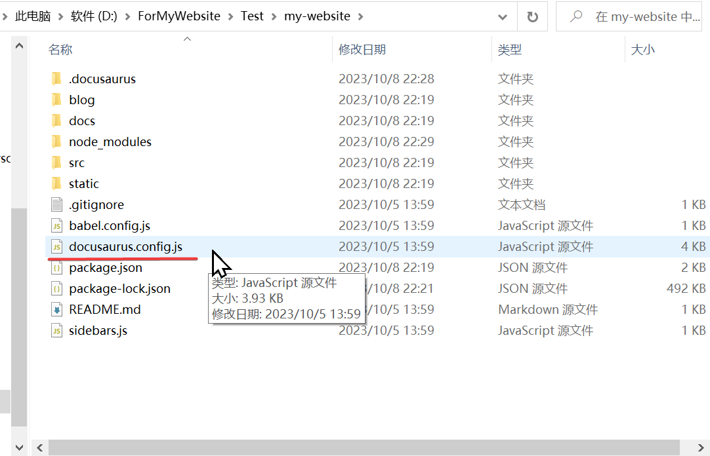

- 按照[  ***官方文档 docusaurus.config.js settings***  ](https://docusaurus.io/zh-CN/docs/deployment#deploying-to-github-pages)这里和下面的示例所说，总共要<W>修改四处、添加两句</W>


#### <B2>步骤：</B2>
1. 把 <W>url</W> 修改为 `https://你的用户名.github.io`
2. <W>baseUrl</W> 修改为 `/你要存放源文件的库/`
3. <W>organizationName</W> 修改为`你的GitHub用户名`
4. <W>projectName</W> 修改为'你要存放源文件的库'  //(注释)和第2条一样，但是去掉两个'/'
5. 添加一行 <W>`deploymentBranch: 'gh-pages',`</W>  
6. 添加一行 <W>`trailingSlash: false,` </W> 
7. Ctrl + S 保存退出

- 以我的为例，修改完后是这样的，其中打<Highlight fontColor={MyColor.red}>**√**</Highlight>的是修改参数的，画⭕的是添加的

import ModifyTheConfigjs from '../../static/img/GenerateSite/ForBuild/ModifyTheConfigjs.png';

<PhotoZoom src={ModifyTheConfigjs} alt="修改配置文件" />


- 可以在官方文档的 <W>API</W> -> <W>docusaurus.config.js</W> 一节里看到
`https://Ratherthan17.github.io` 就是 docusaurus 配置文件中的 url  
`/MyNotes/`  就是 baseUrl

import TheURLAndBaseURL from '../../static/img/GenerateSite/ForBuild/TheURLAndBaseURL.png';

<PhotoZoom src={TheURLAndBaseURL} alt="url和baseUrl" />

- 其他几个修改或添加的内容也能在这一节里找到解释

- 官方建议我们在 <W>static</W> 文件夹下建一个扩展名为 <W>.nojekyll</W> 的空文件

import CreateNojekyell1 from '../../static/img/GenerateSite/ForBuild/CreateNojekyell1.png';

<PhotoZoom src={CreateNojekyell1} alt="创建 .nojekyll 文件" />

- 打开你创建的 my-website 文件夹，再打开 static


- 这里有个奇怪的地方，这个站点是我为了写这个笔记新建出来的，打开 static 后却发现已经有一个 ` .nojekyll ` 空文件了，但我记得当初我第一次创建成功站点的时候是没有的，是我自己新建的。  

  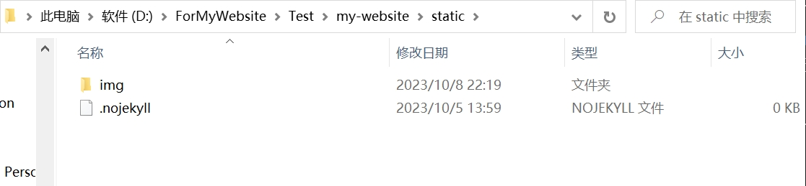

  我又新建了一个站点，发现这次同样有 ` .nojekyll ` 空文件

  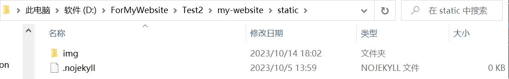

  此外我发现，除了几个文件夹的创建时间 符合我创建新站点成功的时间外（2023/10/14），其他几个文件显示的都是 (2023/10/5 13:59)。 
  
  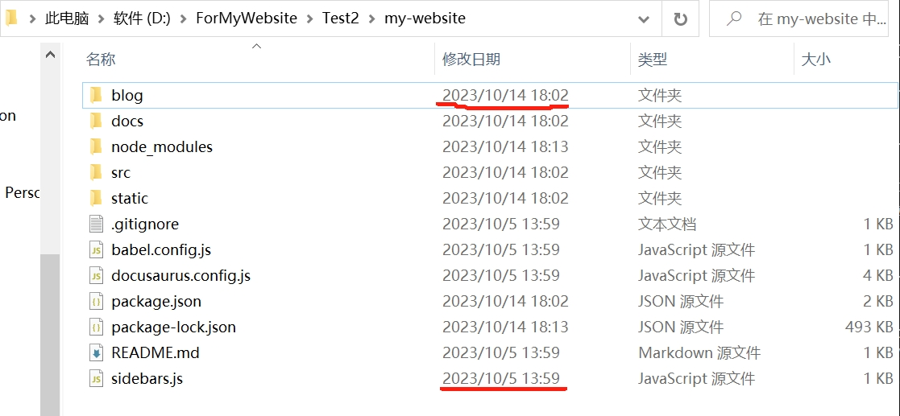 
  
  可恶，那时候我干了啥我忘了。  
  总之，要是你的 static 下有这个文件就不用管了，要是没有就新建一个文本文档，然后把名字删了、再把扩展名改成`.nojekell`


### <B2>4.</B2> 把网站部署到 GitHub Pages 上

 

- 直接复制
  
 ```bash
 cmd /C "set "GIT_USER=<GITHUB_USERNAME>" && yarn deploy"
 ```
 
- 按照上面 “**二、创建本地站点**” 里写的那样打开控制台，`Ctrl + V` 粘贴

 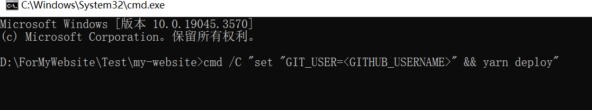

- 把 <W>&lt;GITHUB_USERNAME&gt;</W> 改成你 GitHub 的用户名，然后回车

import DeployToghpages3 from '../../static/img/GenerateSite/ForBuild/DeployTogh-pages3.png';

- <PhotoZoom src={DeployToghpages3} alt="部署到 gh-pages" />

- 接着会开始部署

 

- 部署成功后，就可以打开浏览器，输入 <W>你的用户名.github.io/你部署的仓库名</W>，来查看你的网站了

 
 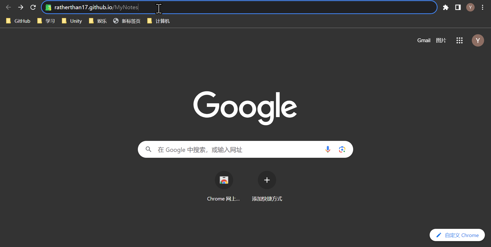
 

:::tip提示
  虽然我的用户名和仓库名首字母都是大写的，但是域名中用户名却是小写的。  
  另外**仓库名必须和你 GitHub 上的仓库名一致**，这里我把 “MyNotes” 写成小写的 "mynotes"，打开的是 404
:::

 
 
- 可以看一下 <W>settings</W> -> <W>pages</W> 中的网址域名，用户名就是小写的，不过我试了试，大写也没事儿
 
 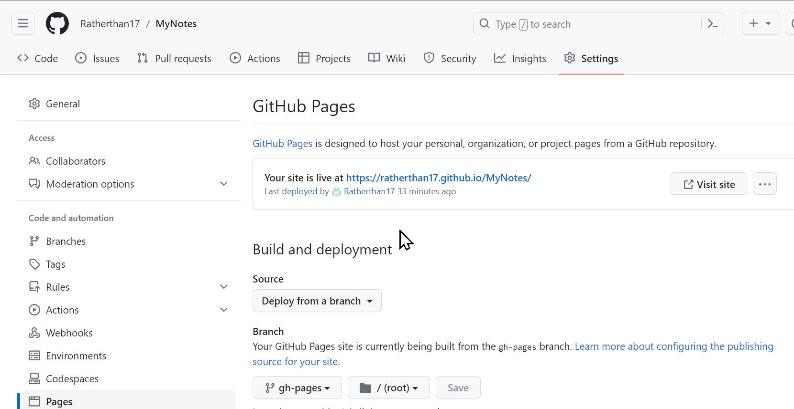

### <B2>5.</B2> 其他一些事情

1. 我当初试了试，看看能不能不创建 <W>用户名.github.io 库</W>，而是直接用一个别的库点击 GitHub Pages 创建站点，结果不行。  
可以看一下 [*GitHub 文档*][a] 、[*如何拥有多个GitHub Pages*][b] 和 [*利用Github实现(多个)个人网站*][c] 这三篇文章。  
用户名.github.io 库是用户站点；之后的 MyNotes 仓库创建的是项目站点，必须得在 **用户名.github.io 库存在**的前提下，才能创建成功。

1. 运行部署命令后，会在 my-website 下创建一个 bulid 文件夹，里面存放着构建出来的 html 文件

  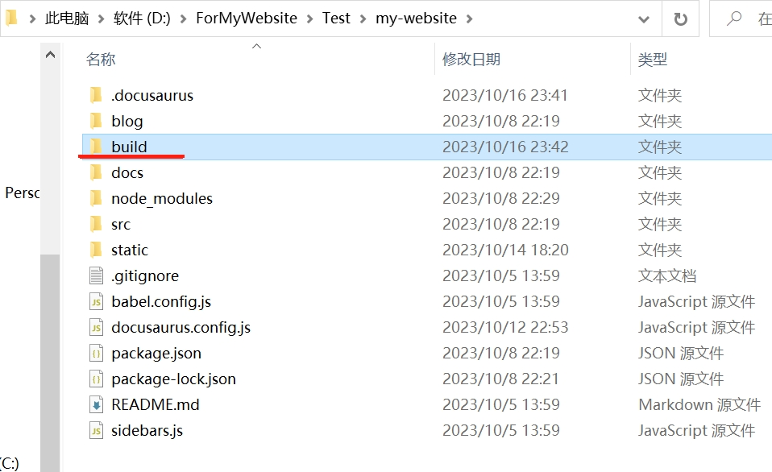
  
  
  部署到 gh-pages 分支的就是这些文件
  
  
  
  这些 html 文件在文件夹里直接打开是这样的，有问题
  
  
  
  用 <W>用户名.github.io/仓库名/文件名</W> 打开就没问题
  
  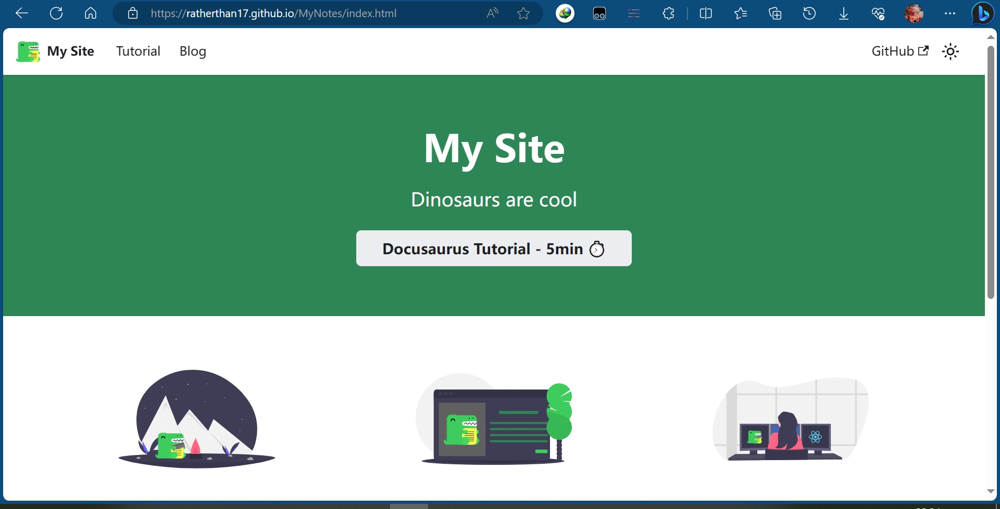

1. main 分支里这时还是空的，可以把网站源代码上传上来，方面管理

  

1. 控制台有一个黄条一直显示 99%，不知道是干啥的，我最后把控制台关了，也没发现出什么问题

  


### <B2>6.</B2> 自定义域名

- 以阿里云购买的域名为例，添加一个记录

  

  - 主机记录的话，可以随便写。关于域名可以看下这个文章：  
    *[🔥二级域名的创建、配置和解析，买一个域名，有无限个域名可以使用的方案。][🔥二级域名的创建、配置和解析，买一个域名，有无限个域名可以使用的方案。]*

  

  - 在 <W>GitHub Pages</W> 的 <W>Custom domain</W> 里填入你的二级域名，点 save

    

    等一会，等网站变成你的二级域名

    

  - 在站点的 <W>static</W> 目录下，新建一个文本文档，命名为 <W>CNAME</W> ，里面不用写东西，空的就行

    


- 修改 <W>docusaurus.config.js</W>

  - url：'https://xxx.zhangyuqi.top/',  
  - baseUrl: '/',

- 然后重新部署一次

 ```bash
 cmd /C "set "GIT_USER=<GITHUB_USERNAME>" && yarn deploy"
 ```

- 遇到的问题

  - 部署后，用 xxx.zhangyuqi.top 打开，显示经典出错红框

  ```
  Your Docusaurus site did not load properly.

  A very common reason is a wrong site baseUrl configuration.
  ```

  - 我看了下 GitHub Pages 的 Custom domain 变成了空的，我又重新填了一下，save，然后就行了

---

## <B1>四、 当初遇到的错误</B1>

- 最开始我用官方文档 "Fast Track" 中的这个命令创建站点老出错  
 ```bash
 npx create-docusaurus@latest my-website classic
 ```


 最后偶然发现他们 5-minute tutorial 教程里的命令能用

 
 ```bash
 npm init docusaurus@latest my-website classic
 ```

  现在这个网站就是用 “5-minute tutorial” 中的命令创建出来的那个。之后我在写这个笔记的时候，为了截出错图片，又用 "Fast Track" 中的命令创了一次，结果成功了，真是莫名其妙！  （既然成功了说明没问题，我就把第二步， “二、创建本地站点”中的命令改成了 "Fast Track "的）

- 这是我用 "Fast Track" 中的指令创建站点时报的错
```
[INFO] Creating new Docusaurus project...
[INFO] Installing dependencies with npm...
npm ERR! code ERESOLVE
npm ERR! ERESOLVE unable to resolve dependency tree
npm ERR!
npm ERR! While resolving: my-website@0.0.0
npm ERR! Found: react@undefined
npm ERR! node_modules/react
npm ERR!   react@"^17.0.2" from the root project
npm ERR!
npm ERR! Could not resolve dependency:
npm ERR! peer react@">=0.14.9" from prism-react-renderer@1.3.5
npm ERR! node_modules/prism-react-renderer
npm ERR!   prism-react-renderer@"^1.3.5" from the root project
npm ERR!
npm ERR! Fix the upstream dependency conflict, or retry
npm ERR! this command with --force or --legacy-peer-deps
npm ERR! to accept an incorrect (and potentially broken) dependency resolution.
npm ERR!
npm ERR!
npm ERR! For a full report see:
npm ERR! C:\Users\Zhang\AppData\Local\npm-cache\_logs\2023-10-06T05_22_12_008Z-eresolve-report.txt

npm ERR! A complete log of this run can be found in: C:\Users\Zhang\AppData\Local\npm-cache\_logs\2023-10-06T05_22_12_008Z-debug-0.log
[ERROR] Dependency installation failed.
[INFO] The site directory has already been created, and you can retry by typing:

  `cd my-website`
  `npm install`
```

---

## 参考资料
>- ⭐[官方文档](https://docusaurus.io/zh-CN/)
>- ⭐[实战：构建以内容为核心的开源文档网站及博客(docusaurus)-2022.9.23(超详细)](https://zhuanlan.zhihu.com/p/567578277)  
>- ⭐[docusaurus部署Github Pages搭建个人博客](https://blog.csdn.net/weixin_44240478/article/details/124883373)  
>- [新手5分钟纯免费搭建个人网站，github的申请与page静态页面的设置](https://www.bilibili.com/video/BV1T341167xo/?spm_id_from=333.337.search-card.all.click&vd_source=4f65863adf19c12522e7026402e62e53)  
>- [Github使用教程-黑马程序员--P10 Github Pages搭建网站](https://www.bilibili.com/video/BV1st411r7Sj?p=10&vd_source=4f65863adf19c12522e7026402e62e53)  
>- [【JAMSTACK】使用 Docusaurus 静态网站生成器搭建个人博客](https://www.bilibili.com/video/BV1uE411x7mE/?spm_id_from=333.788&vd_source=4f65863adf19c12522e7026402e62e53)  
>- [【JAMSTACK】部署 Docusaurus 搭建的个人博客](https://www.bilibili.com/video/BV11E411M7WL/?spm_id_from=333.337.search-card.all.click&vd_source=4f65863adf19c12522e7026402e62e53)
>- [Docusaurus 教程 - 在 20 分钟内构建和部署站点](https://www.bilibili.com/video/BV1Ge4y1D7Y8/?spm_id_from=333.337.search-card.all.click&vd_source=4f65863adf19c12522e7026402e62e53)
>- [个人网站迁移之旅：从博客到知识库，从 Hexo 到 Docusaurus](https://zhuanlan.zhihu.com/p/430942362)  

>[1].[win7安装nodejs失败,提示支持win8.1以上](https://blog.csdn.net/weixin_37254196/article/details/109713817)  
>[2].[个人网站迁移之旅：从博客到知识库，从 Hexo 到 Docusaurus(A1: 从零开始的 Docusaurus 配置生活)](https://zhuanlan.zhihu.com/p/430942362) 

[a]: https://docs.github.com/zh/pages/getting-started-with-github-pages/about-github-pages
[b]: https://zhuanlan.zhihu.com/p/183977963
[c]: https://juejin.cn/post/7215478156948701240
[🔥二级域名的创建、配置和解析，买一个域名，有无限个域名可以使用的方案。]: https://juejin.cn/post/6972877763145367583