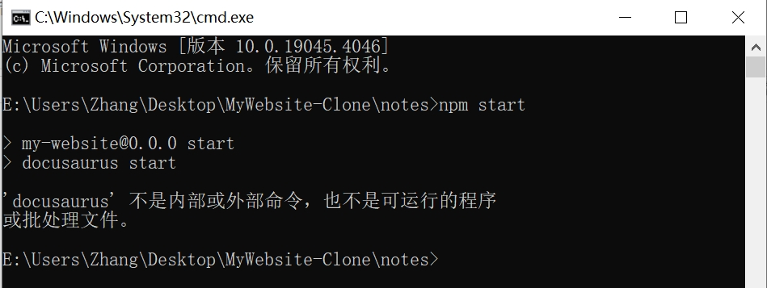
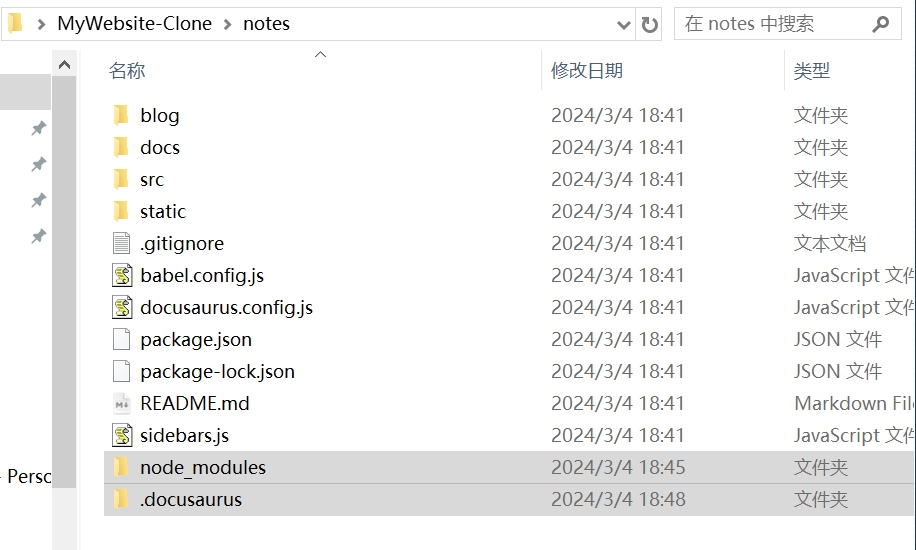
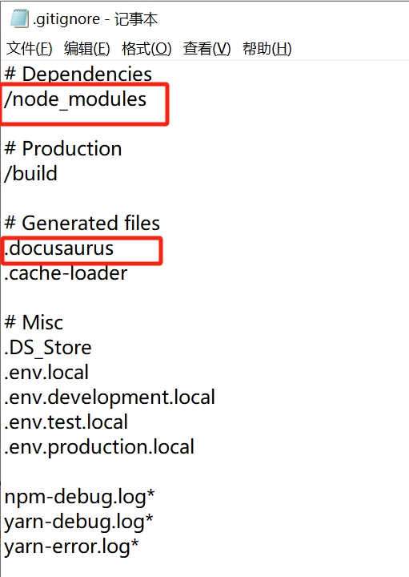

# 从 Github 上 clone 下来的网站，用 npm start 出错

---

- 从 Github 上 clone 下来的网站，运行本地开发服务器时，显示'docusaurus'不是内部或外部命令，也不是可运行的程序或批处理文件

   

- 而我之前备份的网站却可以运行，我对比了一下这两个项目，发现 clone 下来的少俩文件夹
  
   

- 我把那俩文件夹复制进 clone 的项目里，再次运行，运行成功

     
    
    

- 代码库里之所以没有这俩文件夹，是因为它们默认被写进了 ` .gitignore `文件中，把它们删掉就好了

   