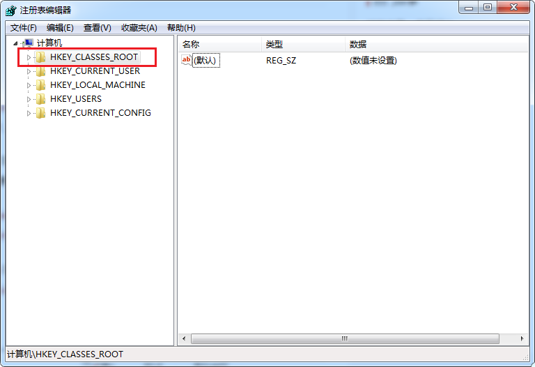
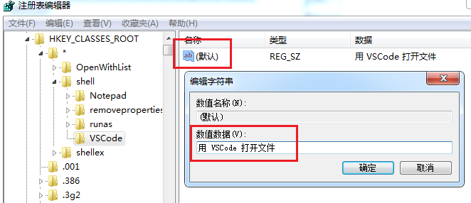
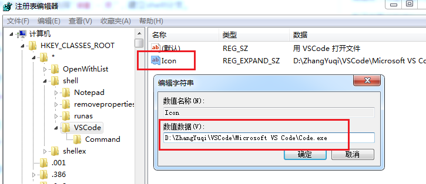
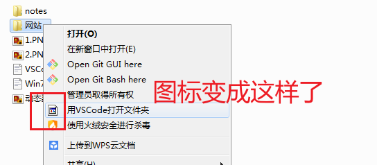
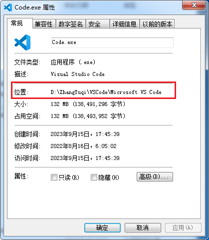

# 在右键菜单添加 “用 VSCode 打开”

---

> 本文参考于 
> 1. [右键菜单，用 VSCode 打开文件和文件夹](https://www.jianshu.com/p/e8c29211fba9)
> 2. [Windows 配置添加右键菜单 —— 在 VSCode 中打开](https://cloud.tencent.com/developer/article/2069620)
>
> 2023年10月26日

---

## 前言

- 之前安装 VSCode 的时候，没有勾选 第二个 和 第三个 选项，导致我没法方便的用 VSCode 打开文件和文件夹 [^下面的图片引用于]
 
](../../../static/img/Software/VSCode/OpenWithVSCode/intall.png) 

- 可以通过修改注册表，来手动添加这个功能
 
- 最终效果：

 
 ---

## 操作步骤

### 用 VSCode 打开文件
 1. 按下 Win + R 键，打开运行，输入 `regedit` 回车打开注册表。  
找到 `HKEY_CLASSES_ROOT\*\shell` 分支

> 如果没有，就自己新建一个：对 * 右键 -> 新建 -> 项 -> 命名为 `shell` 。

2. 右击 `shell` 新建 ` VSCode ` 项，然后双击右侧窗口的 “（默认）”，“数值数据”里输入 `用 VSCode 打开文件`（这里填入的是右键显示的内容，可以自定义编辑）

3. 右击 `VSCode` 新建 `Command` 项，双击右侧窗口的“（默认）”，“数值数据”里输入你的 VSCode 的地址 + %1，我的是： `"D:\ZhangYuqi\VSCode\Microsoft VS Code\Code.exe" "%1"`

4. 添加图标：对 `VSCode` 右击新建 -> 可扩充字符串值 -> 命名为 `Icon` ，双击，“数值数据”里输入你的 VSCode 的地址，我的是：`D:\ZhangYuqi\VSCode\Microsoft VS Code\Code.exe`

:::note备注
经测试：
1. 注册表里的命名不区分大小写
2. 我们新建的这几个项中，  
   不可以自定义命名的有：`shell` 、 `command` 、 `icon` ;  
   可以自定义命名的有：`VSCode` （还可以用中文命名，我把 VSCode 改成 “阿达” 都没问题）
3. “数值数据”里输入的地址，可以不加双引号，不过这样的话第3步中的 `D:\ZhangYuqi\VSCode\Microsoft VS Code\Code.exe` 和 `%1` 之间必须加空格
4. 要是没有 `%1` ，用右键打开文件，效果和打开 Code.exe 一样
:::

---

### 用 VSCode 打开文件夹

和上面大同小异。

1. 在注册表里找到 `HKEY_CLASSES_ROOT\Directory\shell` 分支，注意，这次是 `Directory` ，上面的是 `*`  

2. 右击 `shell` ，新建 `VSCode` 项，双击右侧窗口的 “（默认）”，“数值数据”里输入 `用 VSCode 打开文件夹`

3. 右击 `VSCode` 新建 `Command` 项，双击右侧窗口的“（默认）”，“数值数据”里输入你的 VSCode 的地址，我的是： `"D:\ZhangYuqi\VSCode\Microsoft VS Code\Code.exe" "%1"`

4. 添加图标：对 `VSCode` 右击新建 -> 可扩充字符串值 -> 命名为 `Icon` ，双击，“数值数据”里输入你的 VSCode 的地址，我的是：`D:\ZhangYuqi\VSCode\Microsoft VS Code\Code.exe`

5. 可以把注册表关闭了
    
> 我去，我又发现，对于图标，如果没有双引号的话，地址后面可以有空格；而若是有双引号的话，地址后面不能有空格，否则会变成这样

---

## 犯过的错误

- 最开始直接把属性中的位置 `D:\ZhangYuqi\VSCode\Microsoft VS Code` 复制粘贴进“数值数据”里了，应该在后面再加上 `\Code.exe` （同样不区分大小写，就算写成 coDE.eXE ，也没事）

[^下面的图片引用于]: 图片引用自：[VSCode下载与安装使用教程【超详细讲解】](https://developer.aliyun.com/article/1174015)