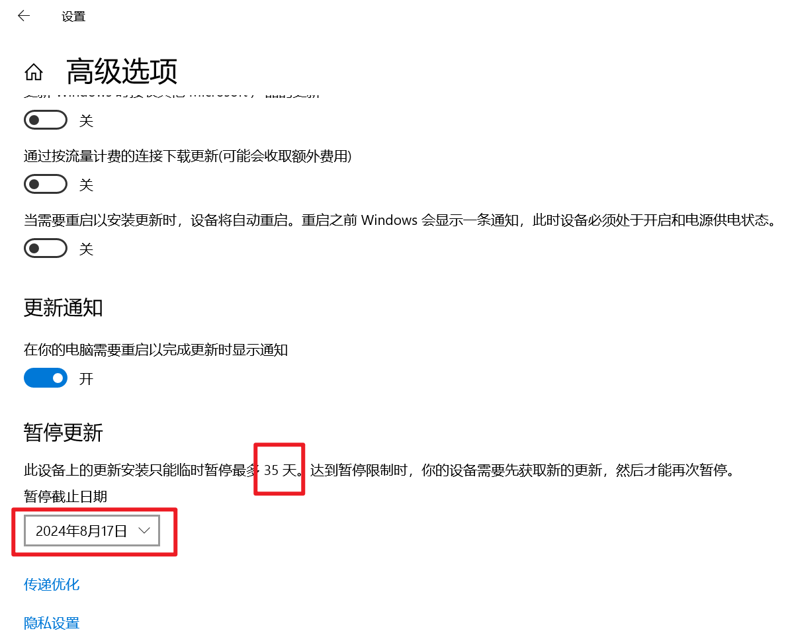
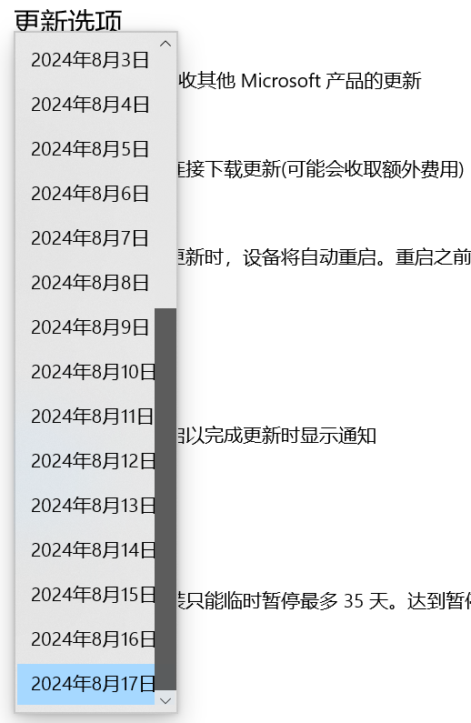

# 延长 Winodws 系统暂停更新天数

---

## 原视频
- [彻底禁用 Windows 自动更新的几种方法！还你的电脑一片清净](https://www.bilibili.com/video/BV1Ew4m1k7gF/?share_source=copy_web&vd_source=407f92cf6751e29e9d623fde5b09db24)

---


## 步骤

- 按下 win+r 输入 regedit 打开注册表编辑器

- 在注册表编辑器中，定位到如下目录：

    ```
    计算机\HKEY_LOCAL_MACHINE\SOFTWARE\Microsoft\WindowsUpdate\UX\Settings
    ```

- 对 Settings 右键，新建一个“DWORD（32位）值（D）”

    

- 将刚创建的值命名为：

    ```
    FlightSettingsMaxPauseDays
    ```
    - 注意：不要有空格和其他名称。

    

- 双击这个值，将基数改为十进制
- 然后就可以在数值数据中输入想要暂停更新的天数了

    


- 点击确定

## 效果

- 开始时可暂停更新天数

    
    


- 做完后可暂停更新天数

    
    
## 其他
- 如果不想用这个了，只要把数改回 0 ，就可以恢复成原来的了
