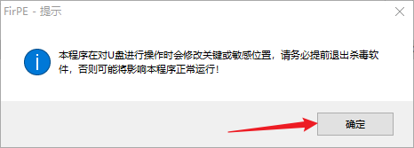
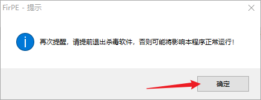
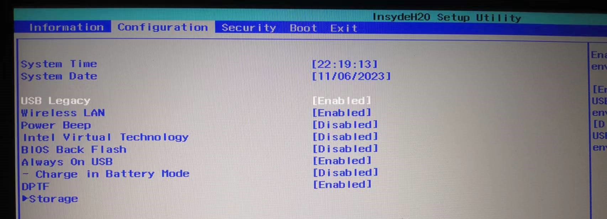
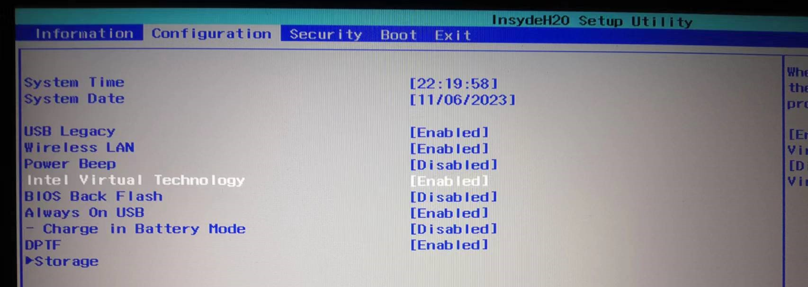
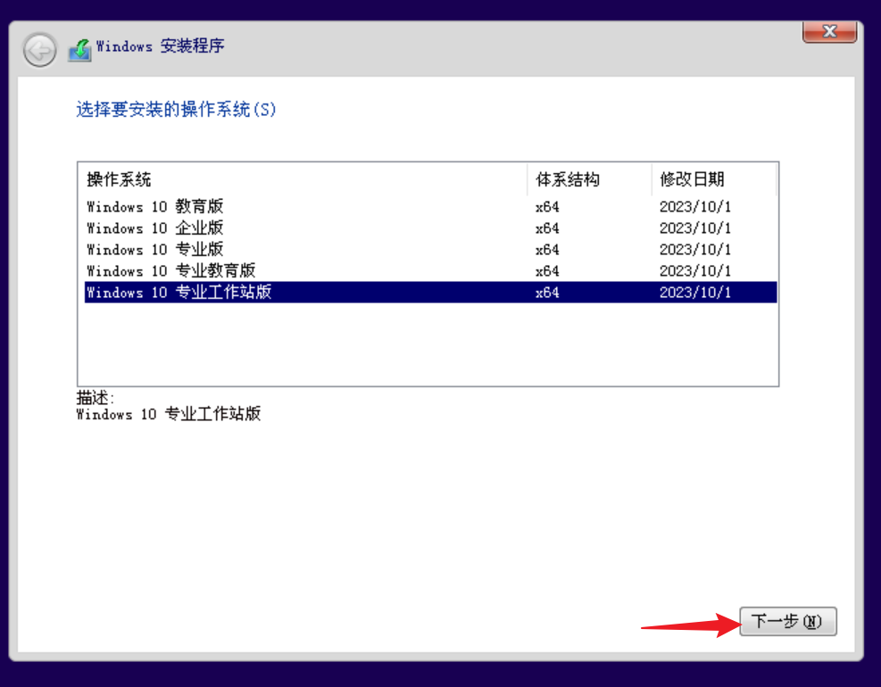
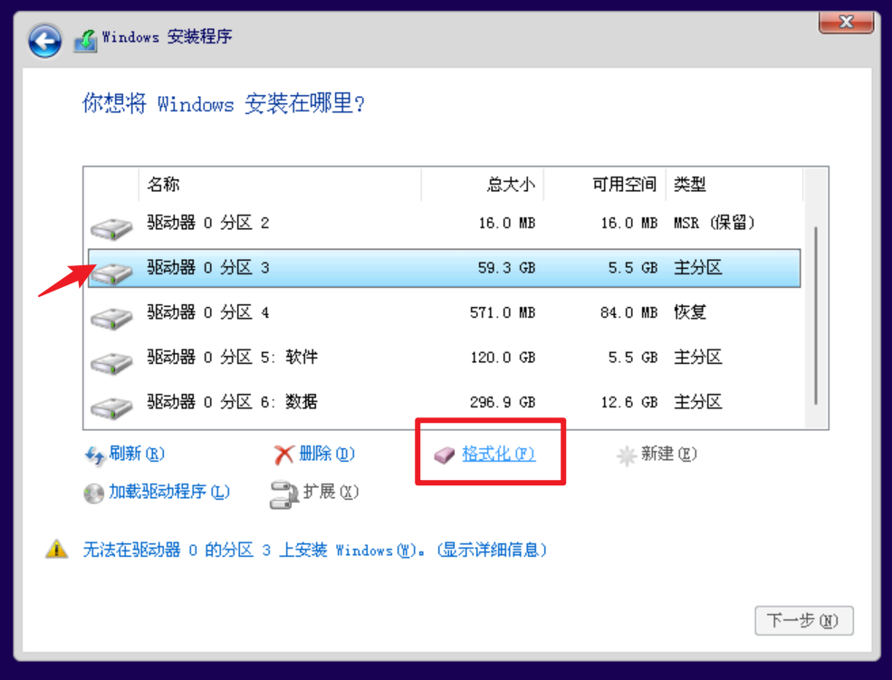

# 用 U盘 重装 Win10 系统（待完善...）

---

## 参考资料及用到的资源地址

### 参考资料

#### 重装系统

- [小白该怎么装系统？全网最全保姆级win10系统安装指南][痞仔伯爵]  
- [重装系统 | FirPE 启动U盘：纯净无广告的U盘维护系统][重装系统 | FirPE 启动U盘：纯净无广告的U盘维护系统]
- [【重装系统win10简单教程】用pe来进行win10系统重装，及微pe与firpe两个常用的pe系统的安装方法和使用体验有什么区别][重装系统win10简单教程]
- [关于联想Y7000的U盘启动的那些事][关于联想Y7000的U盘启动的那些事]
- [如何在Windows 10和11中找到您的主板品牌和型号][如何在Windows 10和11中找到您的主板品牌和型号]
- [电脑pin是什么呀「附：电脑pin设置方法图解」][电脑pin是什么呀「附：电脑pin设置方法图解」]

#### 激活 Windows

- [解决Win10电脑右下角的“激活windows转到电脑设置”的水印的方法][激活 Windows]

### 资源地址

- [MSDN 官网——下载操作系统镜像（老版）] [MSDN（下载操作系统镜像）]；[MSDN（新版）] [MSDN（新版）]  
- [FirPE 官网] [FirPE]


---

## 步骤

:::tip提示
 系统镜像推荐下载这个，这个里面有很多版本可以选择 （这是 *[MSDN（新版）] [MSDN（新版）]* 里的）

 
:::

### 1. 制作启动盘

:::danger警告
制作启动盘的过程中会将U盘格式化，所以别忘了**备份数据**
:::


- 到 *[FirPE 官网 ][FirPE]* 下载 FirPe ，然后打开，它会提示关闭杀毒软件，点击确定

    
    

- 点击 `选择设备`，选择要制作成启动盘的U盘，然后点击 `全新制作`

    

- 我第一次制作失败了，后来改成了 `全能单分区模式` ，就成功了

    

- 制作完成后，关闭 FirPe ，然后把从 MSDN 下载的系统镜像复制进U盘里，放在U盘的哪里都行

### 2. 进入 PE 系统，安装 Win10

#### 设置 USB 启动

- 如果你的电脑本来就是 Win10 的话，那就省事了（ Win11 我没用过不知道行不行）：
    - 按住 shift 键，点击重启，会打开高级启动选项  
    
    

    - 也可以通过点击 Windows -> 设置 -> 更新与安全 -> 恢复 -> 立即重新启动 ，来打开高级启动
   
    
    
    
    
    - 打开后，选择第二个 `使用设备`
    
    
    
    - 选择 EFI USB Device 按回车，接着会重启进入 FirPe 系统

    

    - 有时，可能会有你的U盘，比如这里有我的金士顿的U盘，还有闪迪的固态硬盘   
      我试了试，无论是选它们还是 EFI USB Device ，结果一样，都可以通过U盘启动  
           
       
            
    FirPe 还可以连接 WiFi
        
       
    
- 如果本来的系统不是 Win10 ，就需要重启后连续点按 F2 或 F12 啥的进入BIOS，设置为 USB 启动

    - 不同品牌的主板，进入 BIOS 的按键各不相同，网上的这种各主板按键图根本就不能用；不如直接照着你的电脑型号搜
    
    

    - 查看主板品牌和型号的方法

    :::note备注
    看这篇文章：*[如何在Windows 10和11中找到您的主板品牌和型号][如何在Windows 10和11中找到您的主板品牌和型号]*
    :::

    按 Win + R 打开运行，输入 msinfo32 回车，看主板制造商或者系统 SKU
    ```
    msinfo32
    ```
    
    

    把那串英文用百度一搜，就能知道是啥主板了

    - 如果你的电脑是笔记本，同时还是联想拯救者Y7000，那你走运了，我的也是，进入 BIOS 的按键是 F2   
     进入 BIOS 后，按右方向键到 Configuration ，把下面的 USB Legacy 改成Enable
    
    
    
    还有一个 Intel Virtual Technology 也可以开启，方便以后用Windows沙盒或安装虚拟机
    
    
    
    再移到 Boot ，Boot Mode 改成 Legacy Support；  
    
    Boot Priority 改成 Legacy First，然后按F10，选yes，回车
    
    
    
    - 如果是台式机，七彩虹智能主板，按键是 Delete  
    
    - 必须在刚开始时候就**连续点按**，长按我试过不行


- 找到你之前放进U盘里的系统镜像，右键装载

    

- 双击弹出来的 setup.exe ，终于开始安装系统喽

    
    

#### 安装系统

- 如果之前下载的是 business 版，这里就有好几个版本可以选择，选择一个，点击下一步

    

- 升级我不了解；我是打算所有盘都格式化、完全重新安装的，这里我选择自定义

    

- 格式化盘的时候，看总大小，数字后面是GB的就是C、D等盘；是MB的，不用管

    

    - 如果你的盘符有名字就能知道哪个分区是什么盘，比如我的D盘名是“软件”，那么这个分区5就是我原来的D盘；E盘名是“数据”，那么这个分区6就是我原来的E盘——看下面那个图    
    - 如果没名字，比如我的C盘，还可以通过大小来判断：我当初给C盘分了60G，那么这个分区3就是我原来的C盘。
    重装系统前可以把各个盘的大小记一下，不过如果每个盘的大小都一样，还没名字，那我就不知道怎么区分了

- 把C盘格式化掉

    

- 如果你只想重装C盘的系统，保留其他盘的数据，就不要格式化其他盘。（不过，很多软件都在C盘里有数据，这里即使没有删除，重装后，可能也会出问题）  
    这里我把D盘和E盘也格式化掉，同时为了记录一下怎么分盘，我把它们删了（你不用跟着做）

    

- 删除后，它们会变成未分配的空间，可以在安装完系统后，重新分区。  
- 你想将 Windows 安装在哪里？  
    - 这里我把C盘也删除了，但是并没有像D盘和E盘那样合并在一起，于是我还选择它作为系统盘
    - 如果你这里是一整块也没事，安装完后，还可以通过压缩卷的方式重新分区
    
    

- 接下来，就等系统安装了......

    


- 安装完了之后是重启来着吗？我当初怎么没有截图或拍照？  
  留待补充......

---

### 安装时设置

#### 添加键盘布局

- 添加一个英语键盘，语言选不选美国无所谓，但是键盘布局**不要选英国**，英国的 shift + 3 敲出来的不是 # 而是 £ 
    - 我这里都选成美国，这个是正常的

    
    

#### 要不要 PIN ？

:::note备注
可以看下这篇文章：*[电脑pin是什么呀「附：电脑pin设置方法图解」][电脑pin是什么呀「附：电脑pin设置方法图解」]*
:::

- 我当时选择了联网，结果后面让我设置 PIN 而不是和以前一样设置密码

    
    
    
    

- 我发现我有一个毛病，那就是面临选择时更喜欢选以前经历过的、熟悉的，因为害怕出问题，而逃避走一条新的路

    - 如果你不想设置 PIN ，可以在 `让我们为你连接到网络` 那里，点击左下角的 `我没有 Internet 连接`  
      下一页选择 `继续执行有限设置`，后面就正常了

    

    - 如果以后又想用 PIN 了，可以点击开始 -> 设置 -> 账户 -> 登陆选项 -> Windows Hello PIN

        


---

### 安装完后设置

#### 分区

- 右键左下角的 开始  -> 计算机管理 -> 磁盘管理，对未分配的空间右键选择新建简单卷

    

- 点击下一页

    

- 我先分出 D盘、软件盘 来，我给它分120G，1GB是1024MB，120GB就是122880MB，可以用计算器算一下  
    - 把算出来的值输入到简单卷大小里，然后点击下一页

        

    - 我想给它的驱动器号分为 D，结果选不了，打开此电脑一看，原来是让U盘给占了，把U盘弹出拔了再重新分一次

        
        
    
    - 给D盘取名为“软件”
        
        

    - 点击完成

        

- E盘如法炮制

    

- 最后效果（D盘存了点东西）

    

#### 把此电脑、控制面板添加到桌面

- 在桌面空白处右键 -> 个性化 -> 主题 -> 桌面图标设置

    
   
    - 勾选 `计算机` 、 `控制面板`，确定

    

#### 激活 Windows

:::note备注
看这篇文章：*[解决Win10电脑右下角的“激活windows转到电脑设置”的水印的方法][激活 Windows]*
:::

1. 右键开始 -> Windows PowerShell（管理员）(A) 

    

2. 复制此命令，粘贴回车，等一会，出现弹窗后进行下一步
   
        slmgr /ipk W269N-WFGWX-YVC9B-4J6C9-T83GX

3. 再复制此命令，粘贴回车，等一会，出现弹窗后进行下一步

        slmgr /skms kms.03k.org

4. 最后复制

        slmgr /ato

    

5. 点击开始 -> 设置 -> 更新和安全 -> 激活 查看激活状态

    

---

[痞仔伯爵]: https://www.bilibili.com/video/BV1YR4y1W7xc/?spm_id_from=333.337.search-card.all.click&vd_source=4f65863adf19c12522e7026402e62e53
[重装系统 | FirPE 启动U盘：纯净无广告的U盘维护系统]: https://www.bilibili.com/video/BV1qG411F7uG/?spm_id_from=333.880.my_history.page.click&vd_source=4f65863adf19c12522e7026402e62e53
[重装系统win10简单教程]: https://www.bilibili.com/video/BV1V64y127Jz/?spm_id_from=333.337.search-card.all.click&vd_source=4f65863adf19c12522e7026402e62e53
[关于联想Y7000的U盘启动的那些事]: https://www.bilibili.com/read/cv10447656/
[如何在Windows 10和11中找到您的主板品牌和型号]: https://www.pcworks.cn/experience/47059.html#:~:text=%E5%A6%82%E4%BD%95%E5%9C%A8Windows%2010%E5%92%8C11%E4%B8%AD%E6%89%BE%E5%88%B0%E6%82%A8%E7%9A%84%E4%B8%BB%E6%9D%BF%E5%93%81%E7%89%8C%E5%92%8C%E5%9E%8B%E5%8F%B7
[电脑pin是什么呀「附：电脑pin设置方法图解」]: https://www.tianxiajiu.com/p/5299.html

[激活 Windows]: https://www.cnblogs.com/huke123/p/12111409.html

[MSDN（下载操作系统镜像）]: https://msdn.itellyou.cn/
[MSDN（新版）]: https://next.itellyou.cn/Identity/Account/Login?ReturnUrl=%2FOriginal%2FIndex

[FirPE]: https://firpe.cn/page-247